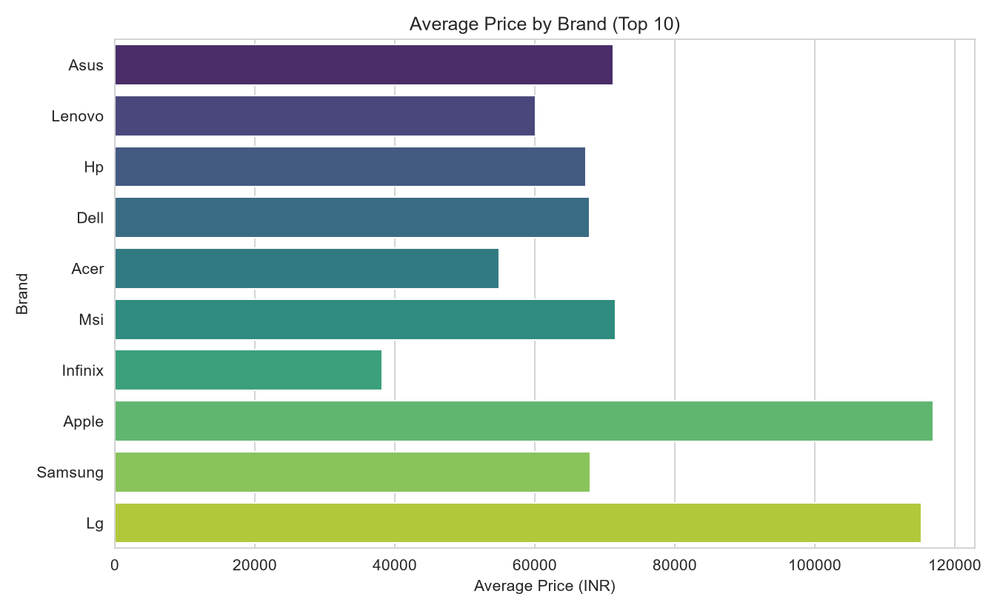
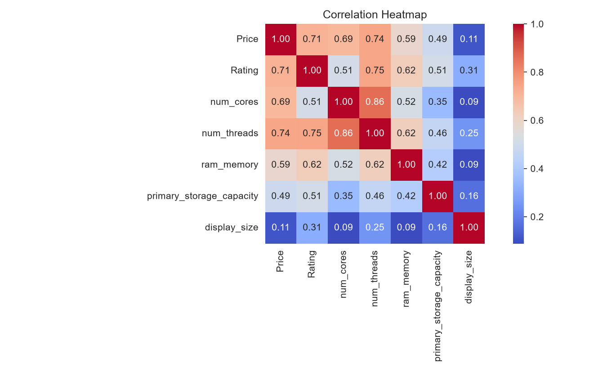
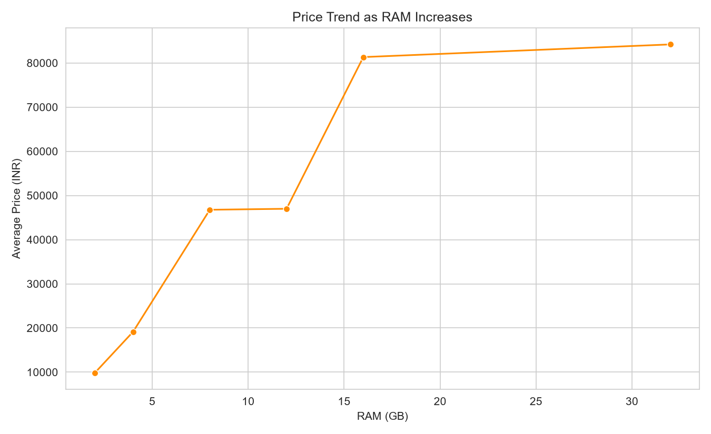

# Laptop Market Analysis

Data analysis and visualization of laptop pricing, specifications, and market trends — a study on what drives laptop price and customer satisfaction, using a real-world dataset of 991 laptop listings.

## Objective

- Analyze how technical specifications (processor, RAM, storage, GPU, display) influence laptop pricing and customer ratings.
- Identify pricing patterns across brands and configurations, and determine which brands offer the best value for money.
- Examine the relationship between hardware specifications and customer ratings.
- Visualize key trends using charts and graphs for clear, data-driven insights.

## Dataset

`data/laptops.csv` — 991 laptop records, 22 attributes: brand, model, price, rating, processor (brand, tier, cores, threads), RAM, storage (type, capacity), GPU (brand, type), display (size, resolution, touch screen), OS, and warranty.

## Methodology

1. **Data Cleaning** — missing value handling, duplicate removal, IQR-based outlier removal on price (991 → 920 records)
2. **Exploratory Data Analysis** — descriptive statistics, brand-wise grouping, correlation analysis
3. **Feature Analysis** — processor brand/tier, storage type, GPU type, touch screen, and warranty vs. price and rating
4. **Visualization** — bar charts, count plots, box plots, violin plots, scatter plots, correlation heatmap, pie charts, histograms, and a pairplot (Python: Pandas, NumPy, Matplotlib, Seaborn)

## Key Findings

| Insight | Result |
|---|---|
| Highest average price brand | Apple (₹1,16,990) |
| Lowest average price brand | Iball (₹9,800) |
| Strongest price driver | Number of threads (r = 0.74) |
| Weakest price driver | Display size (r = 0.11) |
| SSD vs HDD average price | ₹65,278 vs ₹46,317 |
| Dedicated vs Integrated GPU price | ₹85,210 vs ₹54,098 |
| OS market share | Windows 93.6%, Dos 3.5%, Other 2.9% |
| GPU brand market share | Intel 49.6%, Nvidia 31.1%, AMD 18.2% |

## Sample Visualizations

**Average Price by Brand**


**Correlation Heatmap**


**Price Trend as RAM Increases**


## Repository Structure

```
laptop-market-analysis/
├── charts/     # 14 generated visualization PNGs
├── code/       # Python analysis script
├── data/       # laptops.csv dataset
├── report/     # Word report + PowerPoint presentation
└── README.md
```

## Tools Used

Python, Pandas, NumPy, Matplotlib, Seaborn

## Recommendations

- **Buyers**: Best value lies in the Mid-range segment — SSD storage, 16GB RAM, and an i5/Ryzen 5-class processor balance performance and price.
- **Retailers**: Lead marketing with processor tier and thread count — the strongest, most persuasive price justifiers for customers.
- **Manufacturers**: Dedicated GPU and SSD storage both show a clear price-and-rating lift, worth prioritizing in new product lines.

## Author

[Your Name] — [Class / Roll Number] — 2026
